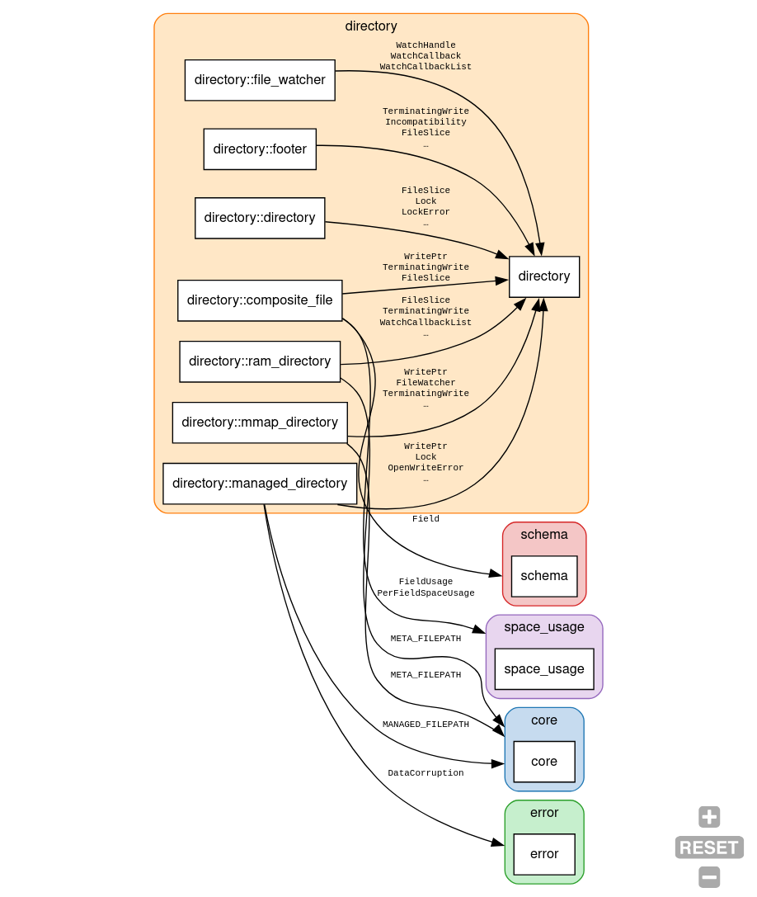

# dep_graph_rs

`dep_graph_rs` generates a dependency graph for the internal modules of a Rust crate.

It uses the [`syn`](https://github.com/dtolnay/syn) crate to parse Rust source code and 
analyzes `use crate::...` statements to build a directed graph of dependencies between modules or files. 
The graph is then output in the [DOT](https://graphviz.org/doc/info/lang.html) language.

**Note**: This tool visualizes dependencies *within* a single crate. It does not show dependencies on external crates from `Cargo.toml`.

## Example

One of the main motivations for this tool is to assist refactoring and understand dependencies.

My use case is to analyze the dependencies of a module before extracting it into a separate crate.
In this case, extracting `tantivy/src/directory` into a new `tantivy-directory` crate.

In this case we want to see on which other modules the `directory` module depends:
```bash
dep_graph_rs tantivy_folder --source "directory.*" > tantivy_directory_deps.dot
```



## Features

*   Generates dependency graphs from Rust source code.
*   Outputs in DOT format for use with Graphviz.
*   Group dependencies by file or by module.
*   Filter the graph by source, destination, or item (e.g., function name).
*   Use an advanced query language with AND/OR/NOT to filter edges.
*   Clusters nodes by their root module for better readability.

## Usage

You can install the tool using `cargo`:

```bash
cargo install dep_graph_rs
```

To generate a dependency graph, run the tool with the path to your crate's root (`src/lib.rs` or `src/main.rs`):

```bash
dep_graph_rs <path-to-your-project|path-to-entry-file> > graph.dot
```

This will output the graph in DOT format to `graph.dot`.

### Rendering the Graph

You can render the generated `graph.dot` file in a few ways:

1.  **Online Viewer:** Paste the content of `graph.dot` into an online viewer like [GraphvizOnline](https://dreampuf.github.io/GraphvizOnline/).
2.  **Local Installation:** If you have [Graphviz](https://graphviz.org/) installed locally, you can use the `dot` command to render the graph to an image:
    ```bash
    dot -Tpng graph.dot -o graph.png
    ```

### Options

*   `--mode <file|module>`: Group the graph by file or by module (default: `module`).
*   `--source <regex>`: Filter by source module/file. 
*   `--destination <regex>`: Filter by destination module/file.
*   `--item <regex>`: Filter by the name of the imported item (e.g., a function or struct).
*   `--query, -q <expr>`: Advanced query. Example: `source:*agg* AND destination:*segment*`. Supports `AND`, `OR`, `NOT`, parentheses, and fields `source|destination|item|any`. `*` is a wildcard; quotes allow spaces. The arrow shorthand `a->b` expands to `source:a AND destination:b`.

For example, to only show dependencies originating from the `graphics` module:

```bash
dep_graph_rs ./test_proj1 --source "graphics" > graph.dot
```

## TODO

- [ ] Better support `*` imports
- [ ] Plain Output for cli usage
- [ ] Go more into `rust_analyzer` territory, e.g. find_references etc.?
